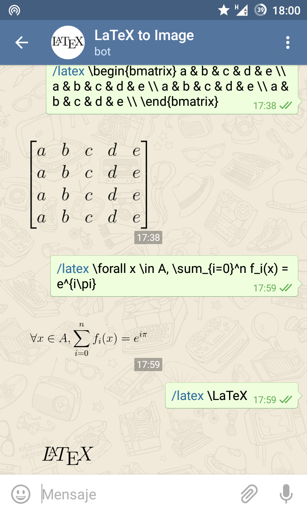

<<<<<<< HEAD
# LaTeX2IMGbot
Telegram Bot that receive an LaTeX equation and uses LaTeX2IMG to send a sticker.

This is developed with [pyTelegramBotAPI](https://github.com/eternnoir/pyTelegramBotAPI) using the listener mechanism. My bot is @LaTeX2IMGbot but you can create your own one =).

## Required packages

You need to install previously **libwebp**, **Pillow** and **pyTelegramBotAPI**. It's very important you get libwebp BEFORE pillow. You can get them using your package manager or using pip.

In Archlinux
```
# pacman -S libwebp python-pillow
```

In Debian-based distros
```
# apt-get install libwebp2 libwebp-dev
```

Using pip
```
# pip install Pillow
# pip install pyTelegramBotAPI
```

## Usage

1. Create a bot with the BotFather Telegram Bot
2. Write the token in token.txt file
3. Execute the bot in your server with ``` ./bot.py ```
4. In the Telegram client you can talk with your bot or add them to groups. All messages beggining with **/latex** or @aliasofyourbot will be catched by your bot.

## Examples



Enjoy it!
=======
# LaTeX2IMG
Pequeño programa para pasar ecuación en LaTeX a imagen usando [codecogs](http://www.codecogs.com/latex/eqneditor.php)

## Uso
```
./LaTeX2IMG <ecuación> <nombresalida> <extensionsalida>
```
>>>>>>> 98e3828a7b4235e92a7eba77c105385de3f2bc69
